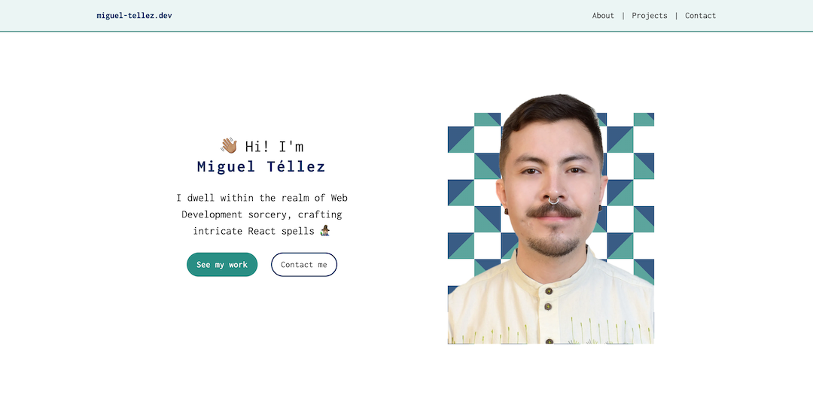
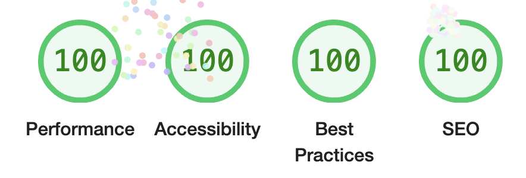

[](https://app.netlify.com/sites/mixiotez-portfolio/deploys)

You can access the live site [here](https://miguel-tellez.dev/)

# Personal Portfolio

## Description

A website built from scratch with Astro. It displays my contact info and my portfolio projects.

## Preview



## Installation

```bash
yarn install && yarn dev
```

> If you run into problems with `sharp`, please use the following command: `yarn add sharp --ignore-engines`

## Features

- 100 score on every Google Lighthouse category

  

- Responsive – Mobile-first approach
- UI animated with vanilla CSS
- Typesafe

## Technologies Used

- HTML
- CSS
- JavaScript
- TypeScript
- Astro
- Tailwind CSS
- Git
- GitHub
- Netlify

## Challenges

- Astro learning curve – This was my first time building something with it.
- Issues with yarn and Netlify: I had to change `package.json` several times until I found a fix.

## Limitations

- Updating the content requires changes to the code.

## Improvements

- Use a database or a CMS to fetch the website's content.
- Implement a Dark theme
